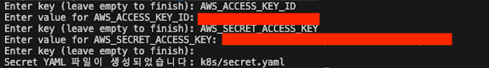
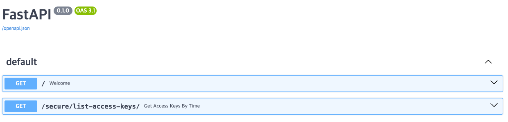
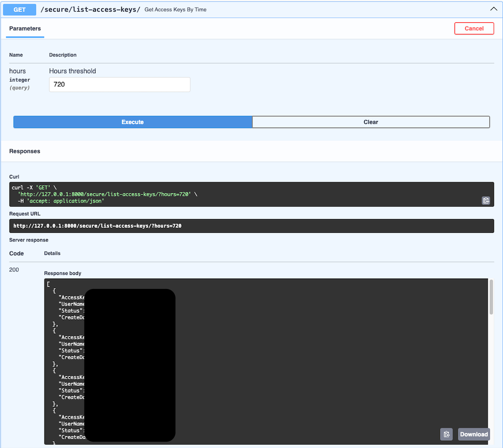

# Installation
> Mac M1을 사용하는 환경에서 로컬 환경과 Minikube 환경에서 설치하여 application을 띄우는 방법을 기록합니다.  
M1이 아닌 다른 환경에서 진행하는 경우 에러가 발생할 수 있으니 사용하는 환경에 맞게끔 설정해주세요.

## (1) kustomization 설치
manifests 적용에 kustomize를 사용합니다.  
니즈에 따라 해당 단계는 생략가능하며, 생략시 일일이 매니페스트 적용이 필요합니다.
```
brew install kustomize
```
## (2) 로컬 환경
로컬 환경에서 시작하기 전 반드시 .env 파일을 생성하고 AWS_ACCESS_KEY_ID, AWS_SECRET_ACCESS_KEY 정보를 입력해주세요.
```
pip install -r requirements.txt
python main.py
```

## (3) Minikube 환경
### minikube 설치
```
curl -LO https://storage.googleapis.com/minikube/releases/latest/minikube-darwin-arm64
sudo install minikube-darwin-arm64 /usr/local/bin/minikube
echo 'export PATH=/usr/local/bin:$PATH' >> ~/.zshrc
source ~/.zshrc
minikube start
```

### minikube & k8s namespace 설정
```
eval $(minikube -p minikube docker-env)
kubectl config set-context --current --namespace=secure-api
kubectl create ns secure-api
```

### Docker 이미지 빌드
```
docker build --no-cache -t secure-api:v1 .
```

### AWS Key 정보전달을 위한 Secret 생성

> AWS_ACCESS_KEY_ID, AWS_SECRET_ACCESS_KEY 를 생성합니다.  
생성을 도울 스크립트가 별도로 있습니다. (*k8s/create-secret.sh*)  
secret은 별도로 관리되며 개별적으로 적용해주세요.
- Value는 평문으로 입력 (스크립트에서 Base64로 인코딩)  
- 완료시 아무것도 기입하지 말고 Enter  
- e.g.)  

```
chmod +x k8s/create-secret.sh
sh k8s/create-secret.sh
kubectl apply -f k8s/secret.yaml
```

### K8S Manifests 배포
Kustomize 비 사용시
```
kubectl apply -f k8s/deploy.yaml
kubectl apply -f k8s/svc.yaml
kubectl apply -f k8s/pdb.yaml
kubectl apply -f k8s/hpa.yaml
```
Kustomize 사용시
```
kubectl apply -k k8s
```

### Minikube Service 노출
> 배포 전 pod의 상태가 Running인지 확인해주세요.

```
minikube service -n secure-api svc-secure-api --url
```
# Usage
## Request
> **Parameter는 옵션이며 입력하지 않는 경우 전체 access keys 리스트를 반환합니다.**

| Parameter | Type | Description     | Required |
|-----------|------|-----------------|----------|
| hours     | int  | 조회하려는 기준시간 (해당 값을 초과하는 결과만 출력)  | No       |

## Response
| Field       | Type   | Description        |
|-------------|--------|--------------------|
| AccessKeyId | string | Access Key의 ID 정보 |
| UserName    | string | 해당 Access Key의 User명 정보 |
| Status      | string | 해당 Access Key의 활성화/비활성화 정보 |
| CreateDate  | string | 해당 Access Key의 생성일 (KST) |

## curl을 통한 테스트
hours 라는 parameter를 전달합니다.
```
curl -X 'GET' \
  'http://127.0.0.1:8000/secure/list-access-keys/?hours=720' \
  -H 'accept: application/json'
```


## web을 통한 테스트
> 해당 어플리케이션은 **hours** 라는 시간 정보를 입력받아 해당 시간을 초과하는 Access Key의 리스트를 Response로 전달하는 어플리케이션 입니다.  

{서비스도메인}/docs 로 접근하여 api 정보를 얻습니다.

필요에 따라 해당 페이지에서 직접적인 Test가 가능합니다.




## Test 종료
```
minikube delete

### 아래는 필요시 사용

##kustomization
#kubectl delete -k k8s

## 개별 매니페스트
# kubectl delete -f k8s/deploy.yaml
# kubectl delete -f k8s/svc.yaml
# kubectl delete -f k8s/pdb.yaml
# kubectl delete -f k8s/hpa.yaml
```